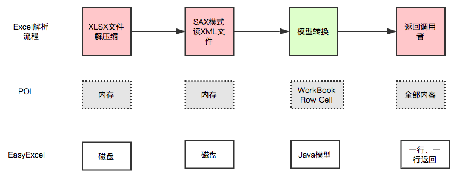
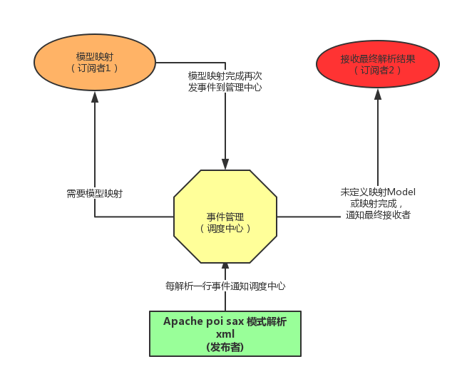

# EasyExcel

## 概述

### 文档地址

https://www.yuque.com/easyexcel/doc/easyexcel

### 介绍

EasyExcel是一个基于Java的简单、省内存的读写Excel的开源项目。在尽可能节约内存的情况下支持读写百M的Excel。 

### 版本

- 2+ 版本支持 Java7和Java6
- 3+ 版本至少 Java8

### 版本支持

- 不建议跨
- 大版本升级 尤其跨2个大版本
- 2+ 升级到 3+ 一些不兼容的地方 

- - 使用了自定义拦截器去修改样式的会出问题（不会编译报错）
  - 读的时候`invoke`里面抛出异常，不会再额外封装一层`ExcelAnalysisException` （不会编译报错）
  - 样式等注解涉及到 `boolean` or 一些枚举 值的 有变动，新增默认值（会编译报错，注解改就行）

- 大版本升级后建议相关内容重新测试下

### 最新版本

~~~xml
<dependency>
    <groupId>com.alibaba</groupId>
    <artifactId>easyexcel</artifactId>
    <version>3.0.5</version>
</dependency>
~~~

## 快速开始

### 读取

### 写入

### Web操作（上传、下载）

## 原理

### Excel格式分析

- xls是Microsoft Excel2007前excel的文件存储格式，实现原理是基于微软的ole db是微软com组件的一种实现，本质上也是一个微型数据库，由于微软的东西很多不开源，另外也已经被淘汰，了解它的细节意义不大，底层的编程都是基于微软的com组件去开发的。
- xlsx是Microsoft Excel2007后excel的文件存储格式，实现是基于openXml和zip技术。这种存储简单，安全传输方便，同时处理数据也变的简单。
- csv 我们可以理解为纯文本文件，可以被excel打开。他的格式非常简单，解析起来和解析文本文件一样。

### 核心原理

​		写有大量数据的xlsx文件时，POI 为我们提供了 SXSSFWorkBook 类来处理，这个类的处理机制是当内存中的数据条数达到一个极限数量的时候就flush这部分数据，再依次处理余下的数据，这个在大多数场景能够满足需求。

​		读有大量数据的文件时，使用 WorkBook 处理就不行了，因为 POI 对文件是先将文件中的cell读入内存，生成一个树的结构（针对 Excel 中的每个 sheet ，使用 TreeMap 存储 sheet 中的行）。如果数据量比较大，则同样会产生 java.lang.OutOfMemoryError: Java heap space错误。POI官方推荐使用“XSSF and SAX（event API）”方式来解决。

分析清楚POI后要解决OOM有3个关键。

#### 文件解压文件读取通过文件形式

#### 避免将全部全部数据一次加载到内存

采用sax模式一行一行解析，并将一行的解析结果以观察者的模式通知处理。

#### 抛弃不重要的数据

Excel解析时候会包含样式，字体，宽度等数据，但这些数据是我们不关心的，如果将这部分数据抛弃可以大大降低内存使用。Excel中数据如下Style占了相当大的空间。