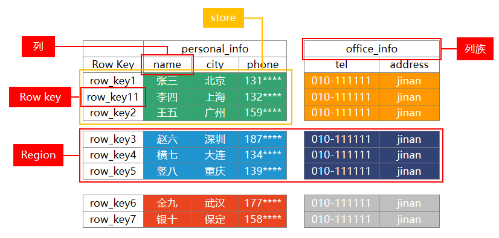
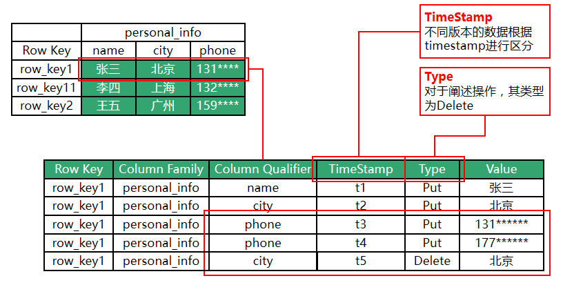
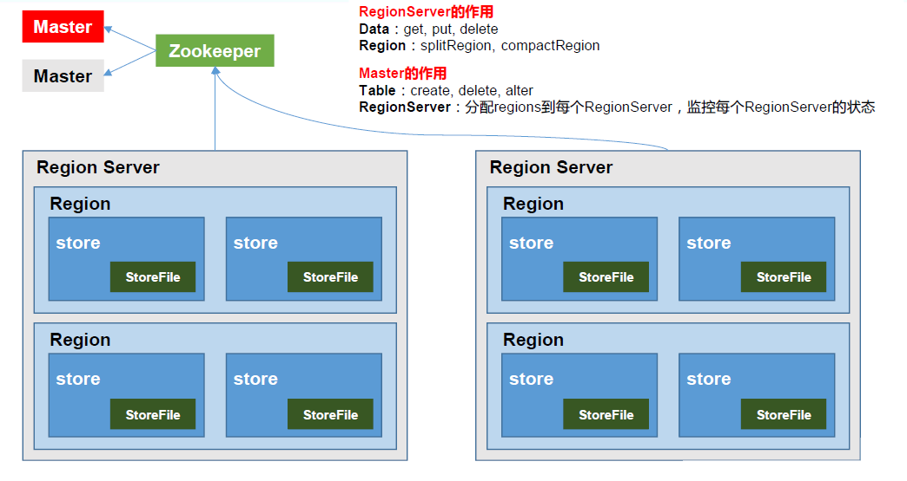
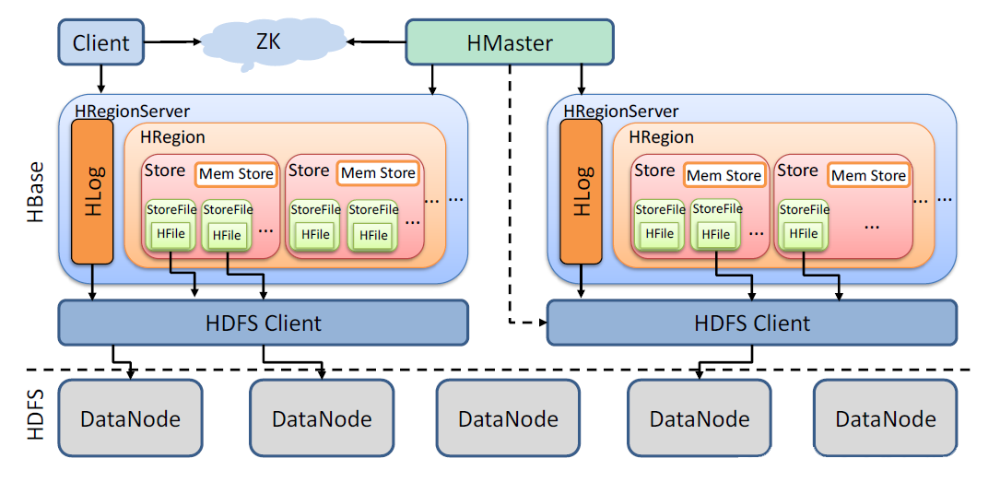
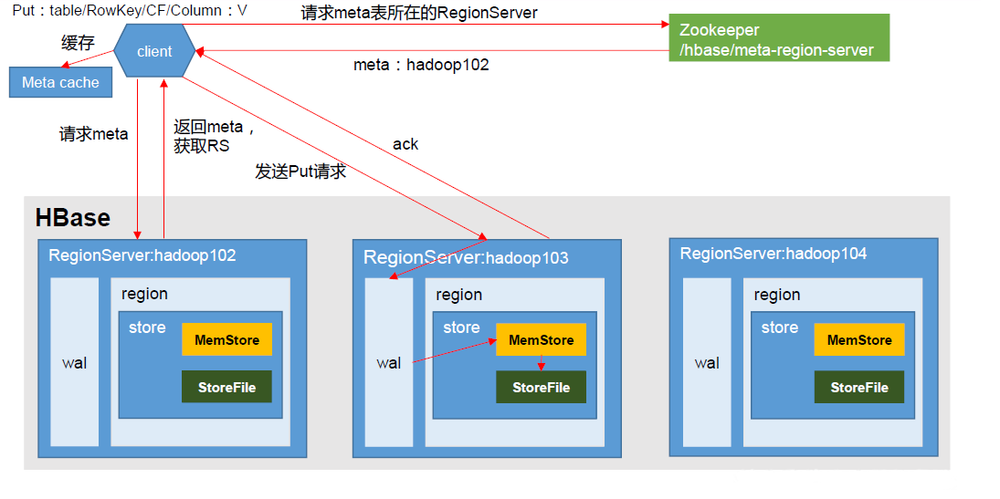
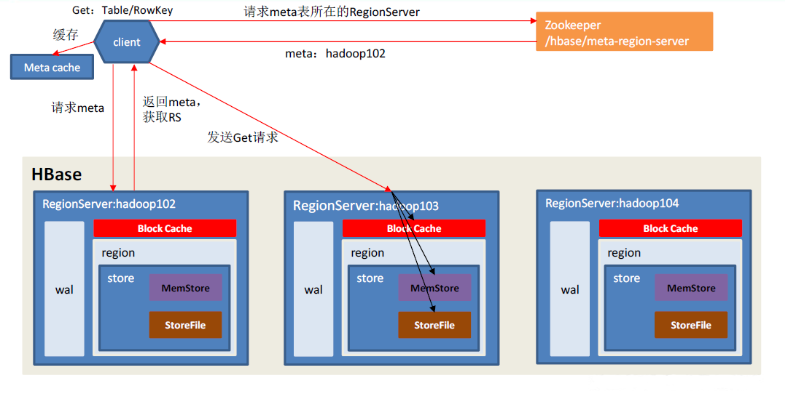
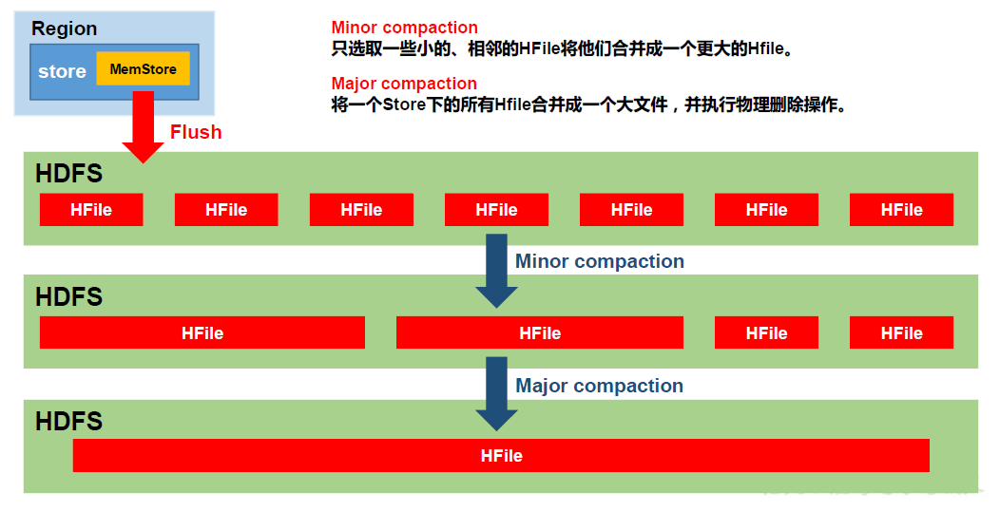
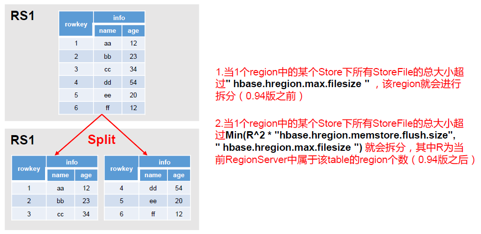

# HBase

## 资料

1. [CSDN资料](https://blog.csdn.net/huxili2020/article/details/120459471?ops_request_misc=%257B%2522request%255Fid%2522%253A%2522165243118816781432982645%2522%252C%2522scm%2522%253A%252220140713.130102334.pc%255Fall.%2522%257D&request_id=165243118816781432982645&biz_id=0&utm_medium=distribute.pc_search_result.none-task-blog-2~all~first_rank_ecpm_v1~rank_v31_ecpm-7-120459471-null-null.142)

## 概述

### 概念

HBase是一种分布式、可扩展、支持海量数据存储的NoSQL数据库，可以解决HDFS随机写的问题

### HBase的特点

1. 大：一个表可以有上亿行，上百万列。
2. 面向列：面向列表（簇）的存储和权限控制，列（簇）独立检索。
3. 稀疏：对于为空（NULL）的列，并不占用存储空间，因此，表可以设计的非常稀疏。
4. 无模式：每一行都有一个可以排序的主键和任意多的列，列可以根据需要动态增加，同一张表中不同的行可以有截然不同的列。
5. 数据多版本：每个单元中的数据可以有多个版本，默认情况下，版本号自动分配，版本号就是单元格插入时的时间戳。
6. 数据类型单一：HBase中的数据都是字符串，没有类型。

### HBase的高并发和实时处理数据

1.  Hadoop是一个高容错、高延时的分布式文件系统和高并发的批处理系统，不适用于提供实时计算；
2. HBase是可以提供实时计算的分布式数据库

### 数据模型

逻辑上，HBase的数据模型同关系型数据库很类似，数据存储在一张表中，有行有列。但从HBase的底层物理存储结构（K-V）来看，HBase更像是一个multi-dimensional map

+ Name Space

  命名空间，类似于关系型数据库的DatabBase概念，每个命名空间下有多个表。HBase有两个自带的命名空间，分别是hbase和default，hbase中存放的是HBase内置的表，default表是用户默认使用的命名空间。

+ Region

  类似于关系型数据库的表概念。不同的是，HBase定义表时只需要声明列族即可，不需要声明具体的列。这意味着，往HBase写入数据时，字段可以动态、按需指定。因此，和关系型数据库相比，HBase能够轻松应对字段变更的场景。

+ Row

  HBase表中的每行数据都由一个RowKey和多个Column（列）组成，数据是按照RowKey的字典顺序存储的，并且查询数据时只能根据RowKey进行检索，所以RowKey的设计十分重要。

+ Column

  HBase中的每个列都由Column Family(列族)和Column Qualifier（列限定符）进行限定，例如info：name，info：age。建表时，只需指明列族
  ，而列限定符无需预先定义。

+ Time Stamp

  用于标识数据的不同版本（version），每条数据写入时，如果不指定时间戳，系统会自动为其加上该字段，其值为写入HBase的时间。

+ Cell

  由{rowkey, column Family：column Qualifier, time Stamp} 唯一确定的单元。cell中的数据是没有类型的，全部是字节码形式存储

### 逻辑结构

​		这种逻辑结构，采用避免全表扫描的分区策略

### 物理存储结构

​		HBase依赖时间戳进行数据的管理，因此时间戳对于HBase十分重要，一定要确保不同系统之间的时间一致，否则在操作HBase时会出现各种异常错误

### 基础架构

+ Region Server

  Region Server为 Region的管理者，其实现类为HRegionServer，主要作用如下:
  对于数据的操作：get, put, delete
  对于Region的操作：splitRegion、compactRegion

+ Master

  Master是所有Region Server的管理者，其实现类为HMaster，主要作用如下：
  对于表的操作：create，delete，alter，select
  对于RegionServer的操作：分配regions到每个RegionServer，监控每个RegionServer的状态，负载均衡和故障转移

+ Zookeeper

  HBase通过Zookeeper来做Master的高可用、RegionServer的监控、元数据的入口以及集群配置的维护等工作

+ HDFS

  HDFS为HBase提供最终的底层数据存储服务，同时为HBase提供高可用的支持

## 原理

### 架构

1. StoreFile
保存实际数据的物理文件，StoreFile 以 HFile 的形式存储在 HDFS 上。每个 Store 会有一个或多个StoreFile（HFile），数据在每个 StoreFile 中都是有序的。
2. MemStore
写缓存，由于 HFile 中的数据要求是有序的，所以数据是先存储在 MemStore 中，排好序后，等到达刷写时机才会刷写到 HFile，每次刷写都会形成一个新的HFile。
3. WAL
由于数据要经 MemStore 排序后才能刷写到 HFile，但把数据保存在内存中会有很高的概率导致数据丢失，为了解决这个问题，数据会先写在一个叫做 Write-Ahead logfile 的文件中，然后再写入 MemStore 中。所以在系统出现故障的时候，数据可以通过这个日志文件重建。

### 写流程

写流程：

1. Client 先访问 zookeeper，获取 hbase:meta 表位于哪个 Region Server
2. 访问对应的 Region Server，获取 hbase:meta 表，根据读请求的namespace:table/rowkey，查询出目标数据位于哪个 Region Server 中的哪个 Region 中。并将该 table 的 region 信息以及 meta 表的位置信息缓存在客户端的 meta cache，方便下次访问。
3. 与目标 Region Server 进行通讯。
4. 将数据顺序写入（追加）到 WAL。
5. 将数据写入对应的 MemStore，数据会在 MemStore 进行排序。
6. 向客户端发送 ack；
7. 等达到 MemStore 的刷写时机后，将数据刷写到 HFile。

### MemStore Flush

MemStore 刷写时机：

1. 当某个 memstroe 的大小达到了 hbase.hregion.memstore.flush.size（默认值128M），其所在 region 的所有 memstore 都会刷写。
   当 memstore 的大小达到了hbase.hregion.memstore.flush.size（默认值128M）* hbase.hregion.memstore.block.multiplier（默认值4）时，会阻止继续往该 memstore 写数据。

2. 当 region server 中 memstore 的总大小达到java_heapsize *hbase.regionserver.global.memstore.size（默认值0.4） *hbase.regionserver.global.memstore.size.lower.limit（默认值0.95），region 会按照其所有 memstore 的大小顺序（由大到小）依次进行刷写。直到 region server 中所有 memstore 的总大小减小到上述值以下。
当 region server 中 memstore 的总大小达到java_heapsize*hbase.regionserver.global.memstore.size（默认值0.4）时，会阻止继续往所有的memstore 写数据。

3. 到达自动刷写的时间，也会触发 memstore flush。自动刷新的时间间隔由该属性进行配置hbase.regionserver.optionalcacheflushinterval（默认1 小时）。

4. 当 WAL 文件的数量超过hbase.regionserver.max.logs，region 会按照时间顺序依次进行刷写，直到 WAL 文件数量减小到 hbase.regionserver.max.log 以下（该属性名已经废弃，现无需手动设置，最大值为32）。

### 读流程

1. Client 先访问 zookeeper，获取 hbase:meta 表位于哪个 Region Server。

2. 访问对应的 Region Server，获取 hbase:meta 表，根据读请求的 namespace:table/rowkey，查询出目标数据位于哪个 Region Server 中的哪个 Region 中。并将该 table 的 region 信息以及 meta 表的位置信息缓存在客户端的 meta cache，方便下次访问。

3. 与目标 Region Server 进行通讯。

   在消息发送的过程中，涉及到了两个线程：main 线程和 Sender 线程 ，以及一个线程共享变量RecordAccumulator。main 主线程负责创建消息，然后通过拦截器、序列化器、分区器作用之后缓存到累加器RecordAccumulator中，Sender 线程不断从 RecordAccumulator中拉取消息发送到 Kafka broker。

4. 分别在 Block Cache（读缓存），MemStore 和 Store File（HFile）中查询目标数据，并将查到的所有数据进行合并。此处所有数据是指同一条数据的不同版本（time stamp）或者不同的类型（Put/Delete）。
5. 将从文件中查询到的数据块（Block，HFile 数据存储单元，默认大小为64KB）缓存到 Block Cache。
6. 将合并后的最终结果返回给客户端。

### StoreFile Compaction

1. 由于 memstore 每次刷写都会生成一个新的 HFile，且同一个字段的不同版本（timestamp）和不同类型（Put/Delete）有可能会分布在不同的 HFile 中，因此查询时需要遍历所有的 HFile。为了减少 HFile 的个数，以及清理掉过期和删除的数据，会进行 StoreFile Compaction。
2. Compaction 分为两种，分别是 Minor Compaction 和 Major Compaction。Minor Compaction 会将临近的若干个较小的 HFile 合并成一个较大的 HFile，但不会清理过期和删除的数据。Major Compaction 会将一个Store 下的所有的 HFile 合并成一个大 HFile，并且会清理掉过期和删除的数据。

### Region Split

默认情况下，每个 Table 起初只有一个 Region，随着数据的不断写入，Region 会自动进行拆分。刚拆分时，两个子 Region 都位于当前的 Region Server，但处于负载均衡的考虑，HMaster 有可能会将某个 Region 转移给其他的 Region Server。
Region Split 时机：

1. 当1 个 region 中的某个 Store 下所有 StoreFile 的总大小超过hbase.hregion.max.filesize，该Region 就会进行拆分（0.94 版本之前）。

2. 当1 个 region 中的某个 Store 下所有 StoreFile 的总大小超过Min(R^2 * "hbase.hregion.memstore.flush.size",hbase.hregion.max.filesize")，该Region 就会进行拆分，其中 R 为当前 Region Server 中属于该 Table 的个数（0.94 版本之后）。

