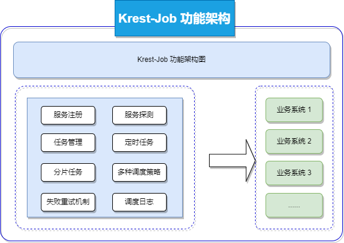
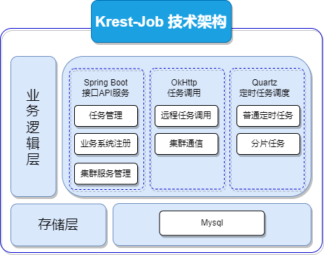
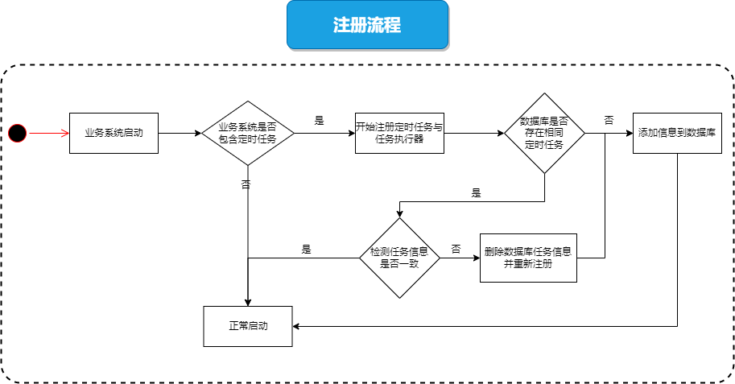
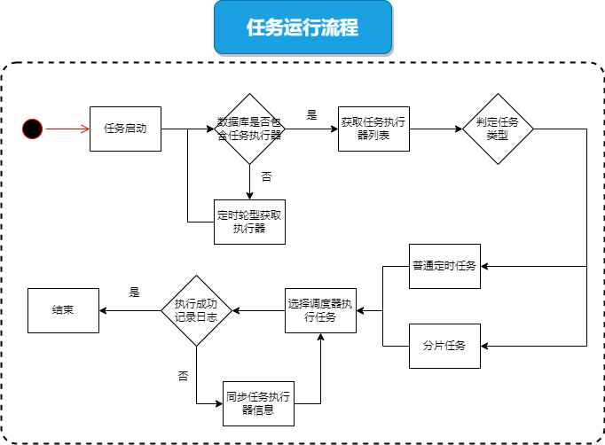
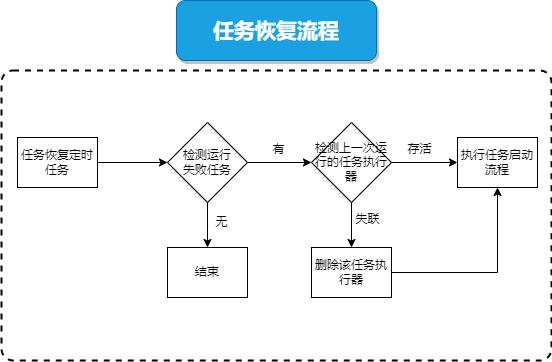
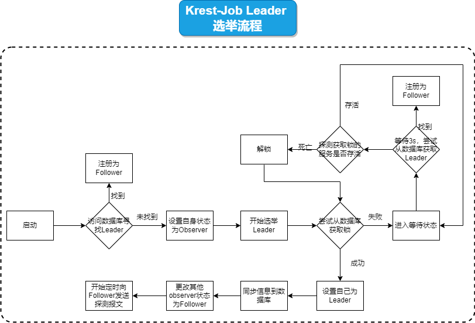

# 分布式任务调度框架 Krest-Job

## 概览

### 功能架构图

### 技术架构图

### 业务流程图

#### 注册流程

#### 执行流程图

#### 任务恢复流程

#### 集群Leader选举流程

## 模块介绍

1. admin 服务端
2. core 核心工具包
3. common 公用工具包
4. demo 示例模块代码
5. starter 客户端依赖

## 已完成功能

1. 客户端服务注册 JobHandler
2. 服务端定时探测服务是否存活，及时更新服务列表
3. 基于Quartz实现分布式任务调度
4. 基于Cron表达式操作任务的调度规则
5. 基于Okhttp3的远程异步
6. 基于Mybatis-plus数据读写
7. 多线程与异步IO设计，高性能
8. 普通任务调度策略：随机、轮询、加权轮询
9. 分片任务调度策略：权重
10. 任务调度失败后动态更新客户端列表，执行重试策略
11. 详细的调度任务日志记录
12. Job-admin 服务之间的相互注册，实现高可用
13. 任务发生故障后，自动转移

    

    

## 未来目标

1. 任务调度的策略增加
2. 增加web管理页面

## 其他

### 分片任务请求报文

~~~json
{
    "appName": "demo-spring-krest-job",
    "createTime": "2022-07-03 16:49:47",
    "id": "1543439397951193088",
    "jobGroup": "default-jobGroup",
    "jobName": "demo-job2",
    "jobType": "SHARDING",
    "args": "[\"1\",\"2\",\"3\",\"4\",\"5\",\"6\",\"7\",\"8\",\"9\"]",
    "cron": "0/5 * * * * ?",
    "loadBalanceType": "WEIGHTROUNDRIBBON",
    "methodType": "POST",
    "path": "service/demo-krestjob/sharding",
    "running": true,
    "retryTimes": 3
}
~~~

### 普通Post任务请求报文

~~~json
{
    "appName": "demo-spring-krest-job",
    "createTime": "2022-06-28 21:33:59",
    "id": "1543439397951193089",
    "args": "from server",
    "jobGroup": "default-jobGroup",
    "cron": "0/5 * * * * ?",
    "jobName": "demo-job3",
    "jobType": "NORMAL",
    "loadBalanceType": "WEIGHTROUNDRIBBON",
    "methodType": "POST",
    "retryTimes": 3,
    "path": "service/demo-krestjob-post",
    "running": true
}
~~~

