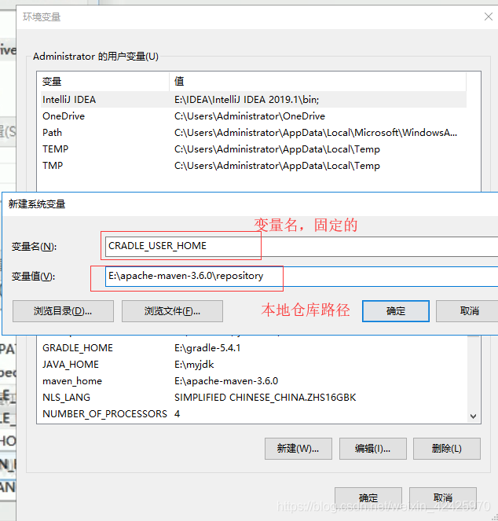

# Gradle

## 历程

1. 2000年使用Ant
2. 2004年使用maven
3. 2012年基于ant盒maven产生么Gradle

Gradle的特点是抛弃了Xml的各种繁琐配置，面向Java应用为主，基于Groovy语言进行编排

## 流程

1. 安装
2. 与idea集成
3. Groovy语言简单链接
4. Gradle仓库
5. Gradle入门案例
6. Gradle创建Java Web应用，并在tomcat下运行
7. Gradle创建多模块应用

## 安装

下载地址：[https://services.gradle.org/distributions/]

环境变量

测试：打开cmd，输入gradle -v，测试下安装成功了没

## gradle使用本地maven仓库的jar包

1. 找到本地maven仓库

   根据实际情况，复制自己的本地maven仓库地址

   

2. 配置环境变量

   我的电脑 -> 右键 -> 属性 -> 高级系统设置 -> 环境变量

   新建环境变量 CRADLE_USER_HOME 值是复制的本地资源仓库的路径（注意：环境变量名是固定的，必须这样写）

   

   

3. 修改配置build.[gradle](https://so.csdn.net/so/search?q=gradle&spm=1001.2101.3001.7020)

   ~~~groovy
   /**
    * 指定所使用的仓库，mavenCentral()表示使用中央仓库，
    * 此刻项目中所需要的jar包都会默认从中央仓库下载到本地指定目录
    * 配置mavenLocal()表示引入jar包的时候，先从本地仓库中找，没有再去中央仓库下载
    */
   repositories {
       mavenLocal()
       mavenCentral()
   }
   ~~~

   

## 新建项目

1. 选择Gradle

2. 配置Idea的Gradle

3. Gradle的项目结构

4. 问题记录：Could not find method testCompile() for arguments

   ​	最近在学习gradle，我使用的是ide的gradle创建的java项目，ide的gradle是很老的版本，需要修改 testImplementation

   ~~~groovy
   dependencies {
       testImplementation group: 'junit', name: 'junit', version: '4.12'
   }
   ~~~

5. 配置文件（因为版本的不同，所以Gradle的配置会有一些差异）

   ~~~groovy
   plugins {
       id 'java'
   }
   
   sourceCompatibility = 1.8
   
   group 'org.example'
   version '1.0-SNAPSHOT'
   
   /**
    * 指定仓库的路径
    */
   repositories {
       /**
        * 表示使用中央仓库，mavenCentral()表示从中央仓库中下载到本地
        */
       mavenLocal()
       mavenCentral()
   }
   
   /**
    * 所有的jar包坐标，都在如下中进行配置
    * 每个坐标包含三个元素：group、name、version
    * testImplementation 在测试的时候起作用，相当于是作用域
    */
   dependencies {
       testImplementation group: 'junit', name: 'junit', version: '4.12'
       implementation group: 'org.springframework', name: 'spring-context', version: '5.3.15'
       implementation group: 'org.wso2.identity.apps', name: 'org.wso2.identity.apps.common.server.feature', version: '1.2.786', ext: 'pom'
   }
   
   ~~~

   

## Groovy 

### 简单使用

~~~
println "hello"  打印

def i=19
println i

def list = ['a','b']
list<<'c'
println list.get(2)

def map = ['key1':'value1']
map.key2 = 'value2'
println map.get('key2')
~~~

### 闭包

闭包就是一段代码块，主要是包闭包当成参数来使用

如一：

~~~groovy
 def b1 = {
    println "hello bi"
}

def method (Closure closure){
    closure()
}

method(b1)
~~~

如二：

~~~groovy
def b2 = {
    v ->
        println "hello ${v}"
}

def method(Closure closure){
    closure("xiao");
}

method(b2)

~~~

